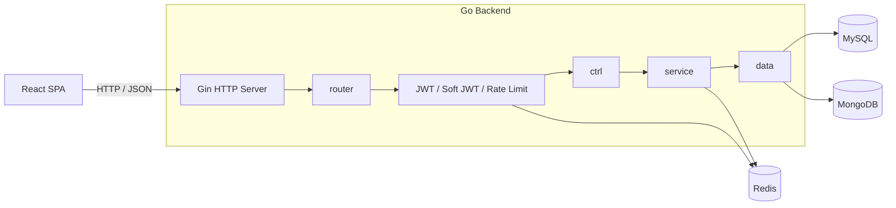

<div align="center">

# Offer Hub

**面向技术面试准备的全栈题库与学习进度平台**

将题库浏览、题目检索、内容阅读、讨论互动与掌握状态追踪整合为一套完整的练习流程。

<p>
  
  
  
  
  
</p>

[核心能力](#核心能力) · [架构设计](#架构设计) · [快速开始](#快速开始) · [接口概览](#接口概览) · [开发规范](#开发规范)

</div>

## 项目概览

Offer Hub 是一个前后端分离的技术面试练习项目。用户可以按技术方向和知识系列选择题库，通过关键词、难度与掌握状态筛选题目，在详情页阅读 Markdown 内容、参与评论讨论，并持续记录个人练习状态。

项目重点不只在页面展示，也覆盖了完整的服务端边界：身份认证、软鉴权、Redis 黑名单、固定窗口限流、分层数据访问，以及 MySQL、MongoDB、Redis 三类存储的职责拆分。

## 核心能力

| 模块 | 能力 |
| --- | --- |
| 题库与题目 | 按职位方向和知识系列组织题库；支持关键词、难度、标签、题库和掌握状态筛选 |
| 内容阅读 | 题目详情、Markdown 渲染、题库内快速切题；游客预览与登录后完整内容 |
| 学习进度 | 已掌握、晚点再刷、未掌握三种个人标记；列表筛选与详情状态同步 |
| 热门榜单 | 按后端热度数据展示热门题目，支持职位方向切换 |
| 评论互动 | 顶层评论、子回复、分页加载、编辑、软删除与点赞 |
| 用户认证 | 注册、登录、退出、JWT 强制鉴权与软鉴权、bcrypt 密码哈希 |
| 安全控制 | Redis Token 黑名单、最新 Token 校验、认证接口限流与 API 通用限流 |
| 工程质量 | Go 单元测试与竞态检查、ESLint、Prettier、TypeScript 构建、pre-commit 统一检查 |

## 架构设计



后端遵循单向分层调用：

```text
router -> ctrl -> service -> data -> database
```

- `router`：注册路由并组合中间件
- `ctrl`：处理 HTTP 参数、身份信息和统一响应
- `service`：编排业务规则，不依赖 Gin 上下文
- `data`：封装 MySQL、MongoDB 和 Redis 访问
- `model`：维护请求、响应与跨层数据结构

### 数据职责

| 存储 | 主要数据 |
| --- | --- |
| MySQL 8 | 用户账户与用户资料 |
| MongoDB | 题库系列、题库、题目、评论、点赞记录、题目掌握状态 |
| Redis | Token 黑名单、最新 Token 状态、限流计数器 |

## 技术选型

| 领域 | 技术 |
| --- | --- |
| Web 前端 | React 18、TypeScript、Vite、React Router |
| UI 与样式 | Tailwind CSS 4、Radix UI、Lucide Icons |
| 数据请求 | TanStack Query、Axios |
| 表单与内容 | React Hook Form、Zod、React Markdown |
| HTTP 服务 | Go 1.22、Gin |
| 数据访问 | GORM、MongoDB 官方 Go 驱动、go-redis |
| 认证安全 | JWT、bcrypt、Redis Token 状态与限流 |
| 本地环境 | Docker Compose、MySQL 8、MongoDB、Redis |

## 快速开始

### 环境要求

- Go 1.22+
- Node.js 20.19+ 或 22.12+
- Docker 与 Docker Compose
- Bash、curl、python3，用于运行 HTTP 回归脚本
- pre-commit，可选，用于启用 Git 提交前检查

### 1. 启动基础服务

```bash
cd backend
docker compose up -d
```

| 服务 | 容器名 | 本地端口 |
| --- | --- | --- |
| MySQL | `mysql-dev` | `3307` |
| MongoDB | `mongodb-dev` | `27017` |
| Redis | `redis-dev` | `6379` |

### 2. 初始化本地数据

创建 MySQL 用户表：

```bash
docker exec -i mysql-dev mysql -uroot -p1234 < testdata/init_mysql_schema.sql
```

写入 MongoDB 题库、系列和题目种子数据：

```bash
docker exec -i mongodb-dev mongosh < testdata/insert_bank_and_series.js
docker exec -i mongodb-dev mongosh < testdata/insert_question.js
```

> 种子脚本会重建对应的本地测试集合，仅用于开发环境，请勿连接生产数据库执行。

### 3. 启动后端

```bash
go mod download
go run ./src
```

服务默认监听 `http://127.0.0.1:8180`。通过健康检查确认应用和数据库连接状态：

```bash
curl http://127.0.0.1:8180/health
```

后端默认读取 `backend/config/config-test.toml`。设置 `APP_ENV` 后，将读取对应的 `config/config-<环境>.toml`：

```bash
APP_ENV=prod go run ./src
```

生产配置不得沿用仓库中的本地测试凭据，也不应提交真实密钥。

### 4. 启动前端

在新的终端中执行：

```bash
cd frontend
npm ci
npm run dev
```

访问 `http://127.0.0.1:3001`。开发服务器会将 `/api`、`/auth` 和 `/home` 请求代理到本地后端。

## 接口概览

业务接口使用统一响应结构，下面是典型成功响应；`msg` 的具体内容由接口语义决定：

```json
{
  "code": 0,
  "msg": "success",
  "data": {}
}
```

| 路径 | 方法 | 鉴权 | 说明 |
| --- | --- | --- | --- |
| `/health` | GET | 无 | 服务与数据库健康检查 |
| `/auth/register` | POST | 无 | 用户注册，带独立认证限流 |
| `/auth/login` | POST | 无 | 用户登录并签发 JWT |
| `/auth/logout` | POST | 强制鉴权 | 登出并写入 Redis 黑名单 |
| `/api/v1/question/*` | GET | 软鉴权 | 题库、列表、详情与热门题目 |
| `/api/v1/open/list_comments` | GET | 软鉴权 | 评论与子评论列表 |
| `/api/v1/comment/*` | POST | 强制鉴权 | 新增、编辑与删除评论 |
| `/api/v1/interaction/*` | POST | 强制鉴权 | 题目或评论点赞、取消点赞 |
| `/api/v1/safe/tag_question` | POST | 强制鉴权 | 更新题目掌握状态 |
| `/api/v1/user_info/get_user_info` | GET | 强制鉴权 | 获取当前用户资料 |

强制鉴权接口使用：

```http
Authorization: Bearer <token>
```

软鉴权接口允许游客访问；携带有效 Token 时，响应会补充当前用户的点赞和掌握状态。

## 常用命令

### 后端

```bash
cd backend

go test ./...          # 运行单元测试
go test -race ./...    # 运行竞态检测
go build ./src/...     # 编译后端
make fmt               # Go 格式化
make vet               # Go 静态检查
```

题目模块游客回归要求后端和本地种子数据已就绪：

```bash
./testsh/question_guest.sh
BASE_URL=http://127.0.0.1:8180 ./testsh/question_guest.sh
```

### 前端

```bash
cd frontend

npm run dev            # 启动开发服务器
npm run build          # TypeScript 检查与生产构建
npm run lint           # ESLint 检查
npm run format:check   # Prettier 格式检查
```

## 项目结构

```text
offer-hub/
├── backend/
│   ├── config/              # TOML 环境配置
│   ├── src/
│   │   ├── config/          # 配置加载与结构定义
│   │   ├── ctrl/            # HTTP 控制器与中间件
│   │   ├── data/            # MySQL、MongoDB、Redis 数据访问
│   │   ├── model/           # 请求、响应与领域数据结构
│   │   ├── ngin/            # Gin 实例创建
│   │   ├── router/          # 路由注册
│   │   ├── service/         # 业务逻辑编排
│   │   └── tools/           # 通用业务工具
│   ├── testdata/            # 表结构与本地种子数据
│   └── testsh/              # HTTP 回归脚本
├── frontend/
│   ├── public/              # 静态资源
│   └── src/
│       ├── components/      # 通用组件与业务组件
│       ├── hooks/           # TanStack Query Hooks
│       ├── lib/             # Axios 实例与基础工具
│       ├── pages/           # 路由页面
│       ├── services/        # API 请求封装
│       ├── types/           # TypeScript 类型定义
│       └── utils/           # 无状态工具函数
├── .pre-commit-config.yaml
├── LICENSE
└── README.md
```

## 开发规范

安装并执行仓库级提交检查：

```bash
pre-commit install
pre-commit run --all-files
```

检查内容包括：

- 行尾空格、文件末尾换行、合并冲突标记与私钥检测
- 前端 lint-staged、Prettier 与 ESLint
- 后端 `go fmt ./...` 与 `go vet ./...`

提交信息遵循 [Conventional Commits](https://www.conventionalcommits.org/)：

```text
feat(frontend): 完成首页与热门题目页面
fix(auth): 修复登录状态恢复异常
docs(readme): 完善项目文档
```

## License

本项目基于 [MIT License](LICENSE) 开源。
